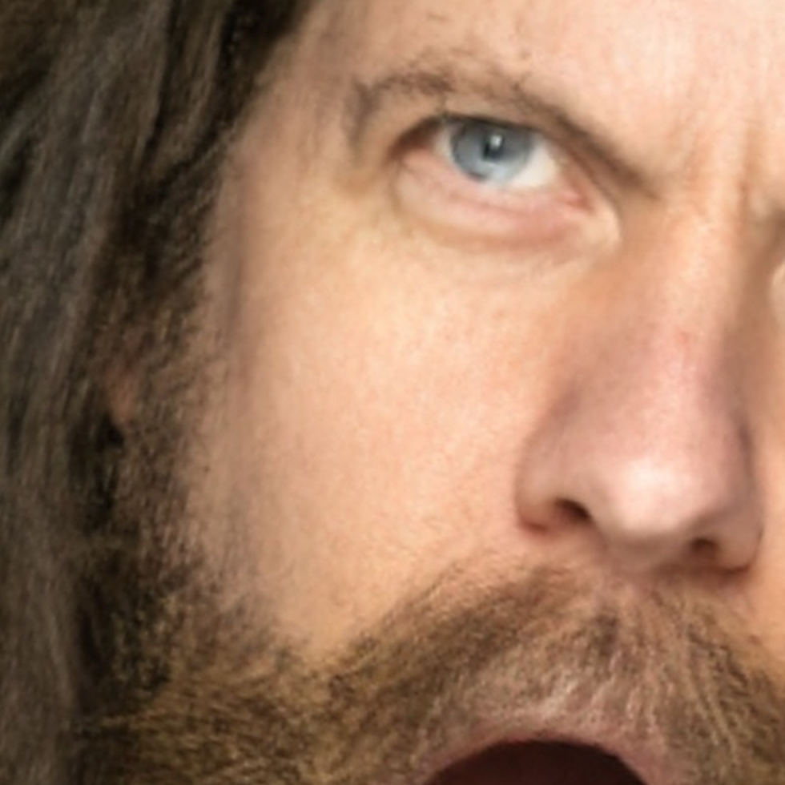
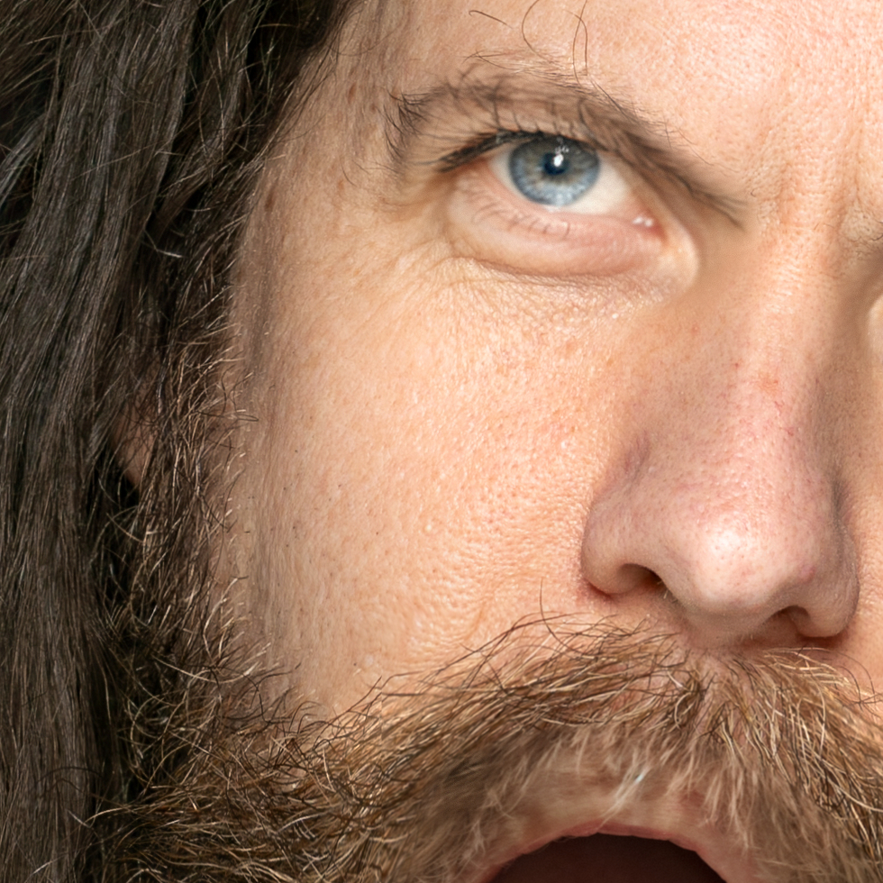

<h1 align="center">LivePortraitHD: Maintaining Detail in Facial Expression Transfer</h1>
a <a href="https://liveportrait.github.io" target="_blank">LivePortrait</a> extension pipeline for 4k facial detail preservation
<div align='center'>
    <a href='https://github.com/danbachmann' target='_blank'><strong>Dan Bachmann</strong></a>
</div>

<div align='center'>
    MSc project <br>
    Queen Mary, University of London
</div>
<br>

<div align="center">
  <p></p>
  <table width="98%"><tr><td width="49%" valign="top">
  <p></td>
  <td width="49%" valign="top">
  
  </td></tr></table>
  </p>
  <p>🔥 For more results, visit <a href="http://www.danbachmann.com/ai/liveportrait_hd/comparison/" target="_blank"><strong>LivePortraitHD comparisons</strong></a> 🔥</p>
<p> For high resolution versions of the report images, visit <a href="https://danbachmann.github.io/ai/LivePortraitHD/" target="_blank"><strong>LivePortraitHD report images</strong></a></p>

</div>
## Introduction 📖
This repo, **LivePortraitHD**, is a fork of the official PyTorch implementation of [LivePortrait: Efficient Portrait Animation with Stitching and Retargeting Control](https://arxiv.org/pdf/2407.03168).
The original LivePortrait code has been slightly modified to expose expression transfer information which is used to guide the high resolution source details. Additional advanced scripts.

## Getting Started 🏁
### 1. Clone the code and prepare the environment 🛠️

> [!Note]
> Make sure your system has [`git`](https://git-scm.com/), [`conda`](https://anaconda.org/anaconda/conda), and [`FFmpeg`](https://ffmpeg.org/download.html) installed. For details on FFmpeg installation, see [**how to install FFmpeg**](assets/docs/how-to-install-ffmpeg.md).

```bash
git clone https://github.com/KlingTeam/LivePortrait
cd LivePortrait

# create env using conda
conda create -n LivePortrait python=3.10
conda activate LivePortrait
```

#### For Linux 🐧 or Windows 🪟 Users
<details>
  <summary>Check your CUDA versions</summary>

  Firstly, check your current CUDA version by:
  ```bash
  nvcc -V # example versions: 11.1, 11.8, 12.1, etc.
  ```

  Then, install the corresponding torch version. Here are examples for different CUDA versions. Visit the [PyTorch Official Website](https://pytorch.org/get-started/previous-versions) for installation commands if your CUDA version is not listed:
  ```bash
  # for CUDA 11.1
  pip install torch==1.10.1+cu111 torchvision==0.11.2 torchaudio==0.10.1 -f https://download.pytorch.org/whl/cu111/torch_stable.html
  # for CUDA 11.8
  pip install torch==2.3.0 torchvision==0.18.0 torchaudio==2.3.0 --index-url https://download.pytorch.org/whl/cu118
  # for CUDA 12.1
  pip install torch==2.3.0 torchvision==0.18.0 torchaudio==2.3.0 --index-url https://download.pytorch.org/whl/cu121
  # ...
  ```

  **Note**: On Windows systems, some higher versions of CUDA (such as 12.4, 12.6, etc.) may lead to unknown issues. You may consider downgrading CUDA to version 11.8 for stability. See the [downgrade guide](https://github.com/dimitribarbot/sd-webui-live-portrait/blob/main/assets/docs/how-to-install-xpose.md#cuda-toolkit-118) by [@dimitribarbot](https://github.com/dimitribarbot).
</details>


Finally, install the remaining dependencies:
```bash
pip install -r requirements.txt
```

### 2. Download pretrained weights 📥

The easiest way to download the pretrained weights is from HuggingFace:
```bash
# !pip install -U "huggingface_hub[cli]"
huggingface-cli download KlingTeam/LivePortrait --local-dir pretrained_weights --exclude "*.git*" "README.md" "docs"
```

If you cannot access to Huggingface, you can use [hf-mirror](https://hf-mirror.com/) to download:
```bash
# !pip install -U "huggingface_hub[cli]"
export HF_ENDPOINT=https://hf-mirror.com
huggingface-cli download KlingTeam/LivePortrait --local-dir pretrained_weights --exclude "*.git*" "README.md" "docs"
```

Alternatively, you can download all pretrained weights from [Google Drive](https://drive.google.com/drive/folders/1UtKgzKjFAOmZkhNK-OYT0caJ_w2XAnib) or [Baidu Yun](https://pan.baidu.com/s/1MGctWmNla_vZxDbEp2Dtzw?pwd=z5cn). Unzip and place them in `./pretrained_weights`.

Ensuring the directory structure is as or contains [**this**](assets/docs/directory-structure.md).

### 3. Download and install other prequisites 📥
<ul>
<li>MediaPipe</li>
<li>Stable Diffusion 1.5</li>
<li>FFMPEG if using a video instead of an image for the driver instead of a static image</li>
</ul>

### 4. Inference 🚀

Use the same parameters as you would for LivePortrait, but instead of running "python inference.py" run "pipeline.bat"
Change the input by specifying the `-s` and `-d` arguments:

```bash
pipeline -s assets/examples/source/DanByNickGregan01.jpg -d assets/examples/driving/d0.mp4
```
